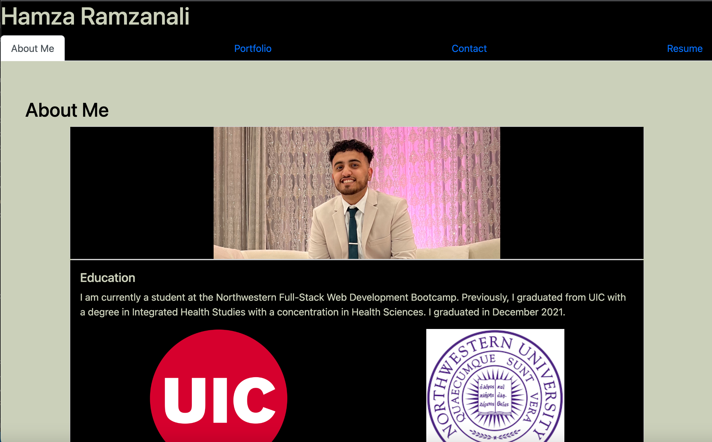
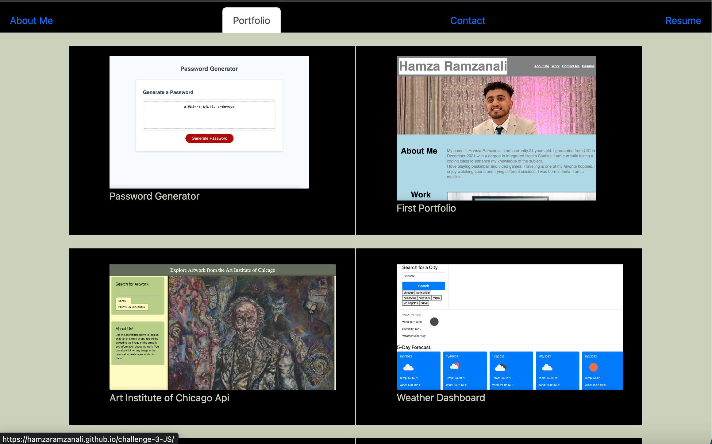
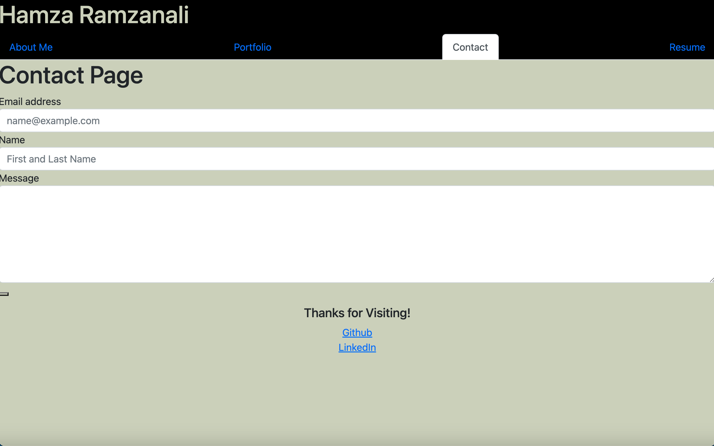

# React Portfolio 

## Description 

This app was created to show information about myself. The website will tell you all about me. You can visit the various sections to see information about me. The 'About Me' page shows a background of who I am. You can read about my past experiences. The 'Portfolio' page shows all the projects I have created, and users can click on the images to visit the websites to use them. The contact page allows users to send an email to me directly from the website if they want to ask questions. At the bottom of each page my LinkedIn and Github are linked. There is also a Resume page showing all my skills. The app was created using React. 

## Screenshots 

